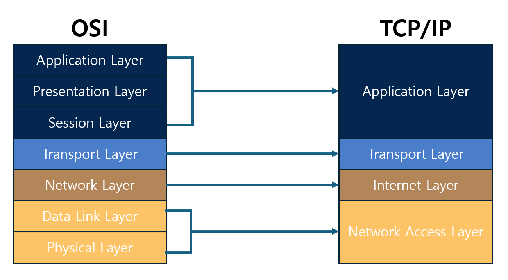
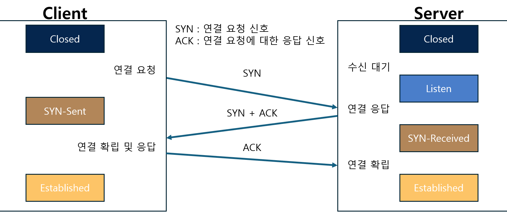

# 목차
****
1. 인터넷
2. TCP/IP
3. 3 - Way Hand Shaking
4. 연결성/상태성
5. URL
6. 개발자 도구
7. 서버와 클라이언트
8. HTTP 요청/응답

## 인터넷
***
인터넷은 컴퓨터로 연결하여 정보를 주고받는 컴퓨터 네트워크를 의미함  
여기서 컴퓨터란 일상에서 사용되는 Personal Computer 외에도 스마트 장비(냉장고, 자동차)나 네트워크 장비를 포함함
인터넷은 두 가지 개념으로 나눌 수 있음. 
첫 번째는 글로벌 규모의 네트워크를 의미하고, 
나머지 하나는 컴퓨터와 컴퓨터를 연결하는 사설 네트워크를 나타낸다. 
후자의 경우는 사설 네트워크를 의미하며, 공인 IP 주소의 부족현상을 해소하기 위한 논리적 네트워크이다.

## TCP/IP
***

TCP/IP 는 TCP 프로토콜과 IP 프토토콜을 합친 용어로 기존 네트워크 통신 모델에서 주로 활용되는 프로토콜에서 따온 이름이다.  
이를 이해하기 위해서는 OSI 7 Layer를 이해할 필요가 있다.  
OSI 7 Layer 는 Application, Presentation, Session, Transport, Network, Data Link, Physical 순으로 구성되어 있다.  
여기서 각 계층의 역할을 간소화한 모델이 TCP/IP 이다.  
TCP/IP 모델은 Application, Transport, Internet, Network Access 계층으로 이루어져 있다.  
Application 계층은 특정 서비스를 제공하기 위해 애플리케이션 끼리 정보를 주고 받는 역할을 한다.  
익숙한 프로토콜로는 HTTP 나 DNS 가 있다. 이외에도 파일전송을 위한 FTP, 원격 접속을 위한 SSH 와 Telnet 등이 존재한다.  
Transport 계층은 통신하는 애플리케이션을 설정하는 역할을 한다.  
예를 들면 하나의 컴퓨터에서 여러가지 서비스를 사용할 경우 Application 계층만으로는 데이터를 구분할 수 없다.  
그러므로 Transport 계층을 통해서 서비스를 구분할 수 있다.  
또한 데이터 전송방식에 따라 TCP 와 UDP 로 구분되어 제공한다.  
Internet 계층은 통신하는 컴퓨터를 설정하는 역할을 한다.  
주로 사용되는 프로토콜에는 IP 프로토콜이 있다.   
IP 주소라는 용어에서 IP 와 같은 의미이며, 논리적 주소이다.  
논리적 주소의 특징은 상대적인 성격을 나타내기 때문에, 사설 네트워크를 구축할 수 있다.  
Network Access 계층은 네트워크에 물리적으로 연결되어 통신하는 역할이다.  
해당 계층에는 물리적 주소를 나타내는 계층과 데이터를 전송하는 계층도 존재한다.  
물리적 주소란 MAC 주소를 나타내며 네트워크 장비의 물리적 주소이다.  

## 3 - Way Hand Shaking
***

서버와 클라이언트가 연결을 설정하는 과정이다.  
이 연결을 통해서 신뢰할 수 있는 연결을 시작하며 서로 데이터 전송 준비가 되었음을 검증한다.
### 1. SYN 단계
연결을 수립하기 위해서 클라이언트가 서버로 연결 메시지를 보낸다.  
여기서 메시지에 SYN 플래그를 초기 시퀀스 번호로 설정하여 전달한다.  
이때 클라이언트는 SYN_SENT 상태가 된다.
### 2. SYN-ACK 단계
서버가 클라이언트의 연결 요청 메시지를 받으면 클라이언트에게 응답을 보낸다.  
응답 메시지에는 SYN 플래그와 ACK 플래그가 모두 설정되어 있다.  
서버는 클라이언트의 시퀀스 번호에 1을 더한 값을 ACK 번호로 설정한다.  
이때 서버는 SYN_RECEIVED 상태가 된다.
### 3. ACK 단계
클라이언트는 서버의 응답을 받고 서버의 시퀀스 번호에 1을 더한 값을 ACK 에 담아서 ACK 메시지를 보낸다.  
이 메시지를 받은 서버는 연결이 성공함을 확인하고 ESTABLISHED 상태가 된다.  
클라이언트도 메시지를 보내면서 ESTABLISHED 상태로 전환되어 통신의 신뢰성이 수립된다.  

## 연결성/상태성
***
### 연결성 (3 - Way Hand Shaking)
통신을 시작하기 전에 두 통신 장치 간 선행 연결 설정이 필요한 통신 방식을 의미함.  
연결 설정 과정에서는 통신 경로, 데이터 전송 순서, 오류 검출 및 수정 등이 포함됨.  
연결이 수립되면 데이터를 전송하게 되고 전송을 마치면 연결 종료 절차를 통해 연결을 종료함.(4-Way Handshake)  
대표적으로 TCP 프로토콜이 있음.
### 비연결성
데이터 전송 이전에 연결수립 과정이 없는 통신 방식.  
각 데이터 전송은 연결 수립과 헤제 과정이 없기에 데이터의 전송 순서가 달라질 수 있음.  
사전/사후 과정이 없으므로 더 빠르고 간단하며, 자원을 효율적으로 사용할 수 있다.  
하지만 데이터의 전송 순서와 신뢰성이 보장되지 않으므로 추가 설정이 필요함.  
대표적으로 UDP(보이스톡, 디스코드) 프로토콜이 있음. 
### 상태성
서버가 이전 요청과 결과를 기억하고, 후속 요청을 처리하는 방식.  
클라이언트와 서버간 세션 정보가 서버에 유지하게 되며, 이 정보는 사용자의 상태를 관리한다.
TCP 가 해당 내용에 포함된다.
### 비상태성
서버가 이전 요청의 상태를 유지하지 않고 각 요청을 독립적으로 처리하는 방식.  
요청을 받을 때마다 필요한 정보를 함께 받아야 하며, 처리를 마치면 정보가 유지되지 않음.  
일반적으로 쿠키나 세션으로 상태 정보를 클라이언트에 저장해서 관리함.  
일반적으로 HTTP 프로토콜이 예시중 하나이다.  
세션은 상태성의 세션과 동일 용어이지만 클라이언트와의 연결상태를 기억하지 않는 점에서 차이가 있음.
